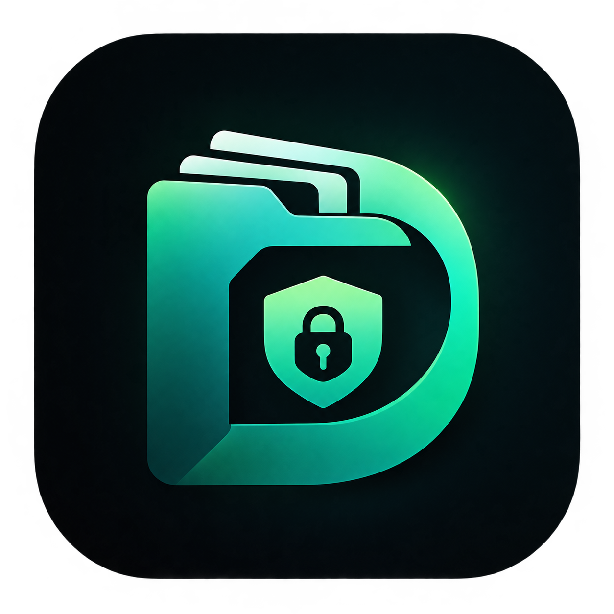
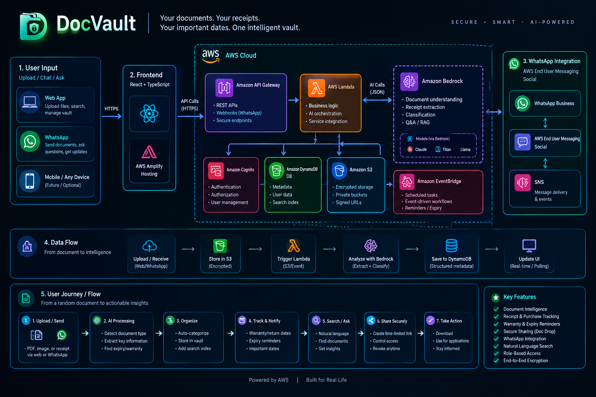

<div align="center">
  

  <h1>DocVault</h1>
  <p><strong>Your documents. Your receipts. Your important dates. One intelligent vault.</strong></p>

  <p>
    
    
    
    
    
  </p>
</div>

---

## What is DocVault?

DocVault is a secure, AI-powered personal document vault built entirely on AWS serverless infrastructure. Upload any document — a receipt, invoice, insurance policy, degree certificate, or ID card — and DocVault automatically extracts structured information, tracks warranty and expiry dates, and lets you find anything with plain-English questions.

**Core product loop:**
```
Upload → Understand → Organize → Extract → Track → Search → Act
```

---

## Architecture



---

## Features

| Feature | Description |
|---|---|
| **Secure Document Vault** | Upload PDF, JPG, PNG, WebP — encrypted at rest with AES-256, versioned S3 |
| **AI Document Intelligence** | Amazon Bedrock Nova Pro extracts document type, issuer, dates, amounts |
| **Receipt Intelligence** | Auto-extracts merchant, amount, product, warranty period, return deadline |
| **Warranty & Expiry Tracking** | Real-time status: ACTIVE / EXPIRING SOON / EXPIRED with days countdown |
| **Ask Vault** | Natural language search — "Which warranties expire in 90 days?" |
| **Smart Package Builder** | Describe a purpose → AI suggests relevant docs → you confirm → share |
| **Secure Doc Drop** | Time-limited share links (1h/24h/7d), download limits, instant revocation |
| **Dashboard** | Attention alerts, recent uploads, expiring warranties at a glance |
| **Audit Trail** | Every action logged — upload, download, share, revoke, query |

---

## AWS Services

| Service | Purpose |
|---|---|
| **Amazon Cognito** | User authentication — email sign-up, JWT tokens |
| **Amazon S3** | Document storage — private, AES-256 encrypted, versioned |
| **Amazon DynamoDB** | Documents, shares, audit tables — on-demand billing |
| **AWS Lambda** | API handler + S3-triggered async document processor |
| **Amazon API Gateway** | REST API — proxy integration to Lambda |
| **Amazon Bedrock (Nova Pro)** | Multimodal document analysis, vault queries, package suggestions |
| **AWS SAM** | Infrastructure as Code — single `template.yaml` |
| **Amazon CloudWatch** | Structured logs, 30-day retention |

---

## Project Structure

```
DocVault/
├── backend/
│   ├── api.py              # All REST API handlers (20 endpoints)
│   ├── processor.py        # S3-triggered async document processor
│   ├── requirements.txt    # boto3 only — zero external dependencies
│   └── samconfig.toml      # SAM deploy config
├── frontend/
│   ├── src/
│   │   ├── api/client.ts   # Typed API client with Cognito auth
│   │   ├── components/     # UploadModal, ShareModal, StatusBadge, Layout
│   │   └── pages/          # Dashboard, Documents, Receipts, Warranties,
│   │                       # AskVault, Shared, Settings, DocumentDetail
│   ├── .env.example        # Copy to .env and fill in deployed values
│   └── index.html
├── docs/
│   ├── architecture.png    # Architecture diagram
│   └── logo.png            # App logo
├── template.yaml           # SAM infrastructure (Cognito, S3, DynamoDB, Lambda, API GW)
├── s3_notification.json    # S3 → Processor Lambda notification config
├── seed_demo.py            # Seeds 10 realistic demo documents
└── DEMO.md                 # 3-minute hackathon demo script
```

---

## Quick Start

### Prerequisites

- [AWS CLI](https://aws.amazon.com/cli/) configured
- [AWS SAM CLI](https://docs.aws.amazon.com/serverless-application-model/latest/developerguide/install-sam-cli.html)
- [Node.js 20+](https://nodejs.org/)
- Python 3.11+

### 1 — Deploy the Backend

```bash
# Build Lambda packages
sam build --template template.yaml --config-file backend/samconfig.toml

# Deploy all AWS resources (Cognito, S3, DynamoDB, Lambda, API Gateway)
sam deploy --config-file backend/samconfig.toml --region us-east-1

# Note the outputs — you'll need them for the frontend .env
# ApiUrl, UserPoolId, UserPoolClientId, BucketName
```

### 2 — Wire S3 → Lambda Notification

```bash
# Update s3_notification.json with your Processor Lambda ARN from the deploy output
# Then apply it:
aws s3api put-bucket-notification-configuration \
  --bucket <BucketName from deploy> \
  --notification-configuration file://s3_notification.json \
  --region us-east-1
```

### 3 — Configure the Frontend

```bash
cd frontend
cp .env.example .env
# Edit .env with your deployed ApiUrl, UserPoolId, UserPoolClientId
```

### 4 — Run Locally

```bash
npm install
npm run dev
# Open http://localhost:5173
```

### 5 — Deploy the Frontend

```bash
npm run build
aws s3 sync dist/ s3://<FrontendBucketName>/ --delete \
  --cache-control "public,max-age=31536000,immutable" --exclude "*.html"
aws s3 cp dist/index.html s3://<FrontendBucketName>/index.html \
  --cache-control "no-cache,no-store,must-revalidate" --content-type text/html
```

### 6 — Seed Demo Data (Optional)

```bash
# Requires DOCUMENTS_TABLE env var or edit the script directly
python seed_demo.py
```

---

## Environment Variables

### Frontend — `frontend/.env`

| Variable | Description |
|---|---|
| `VITE_API_URL` | API Gateway URL from SAM deploy output |
| `VITE_USER_POOL_ID` | Cognito User Pool ID |
| `VITE_USER_POOL_CLIENT_ID` | Cognito App Client ID |
| `VITE_AWS_REGION` | AWS region (e.g. `us-east-1`) |

### Lambda (set automatically by SAM via `template.yaml`)

| Variable | Value |
|---|---|
| `DOCUMENTS_TABLE` | `docvault-documents-{env}` |
| `SHARES_TABLE` | `docvault-shares-{env}` |
| `AUDIT_TABLE` | `docvault-audit-{env}` |
| `BUCKET_NAME` | `docvault-docs-{accountId}-{env}` |
| `BEDROCK_MODEL_ID` | `us.amazon.nova-pro-v1:0` |
| `USER_POOL_ID` | Cognito User Pool ID |

---

## Security

- **Auth** — Cognito JWT; `userId` is always extracted from the token, never from request body
- **Isolation** — DynamoDB `userId` as partition key makes cross-user access structurally impossible
- **Storage** — Private S3 bucket, all public access blocked; files accessed only via short-lived presigned URLs (1h TTL)
- **Input validation** — File type checked by both extension and MIME type; 50MB size limit; S3 keys stripped to `[a-zA-Z0-9_-]`
- **Shares** — TTL-based expiry via DynamoDB TTL + application check; revocable instantly; download count enforced atomically
- **IAM** — Lambda role with explicit least-privilege: only the 3 DocVault tables, 1 S3 bucket, Bedrock inference

---

## AI — Amazon Bedrock

**Model:** `us.amazon.nova-pro-v1:0` (Nova Pro, cross-region inference profile)

**Document processing pipeline:**
1. File uploaded to S3 → triggers Processor Lambda via S3 event
2. Lambda downloads file, base64-encodes it, sends to Bedrock with a structured extraction prompt
3. Bedrock response validated against schema — free-form AI output never directly mutates DB
4. Structured metadata written to DynamoDB; document status set to `READY`

**Graceful degradation:** If Bedrock is unavailable (account tier restriction), documents are still set to `READY` with basic metadata — fully accessible for download, sharing, and manual editing.

> **To enable full AI on the new AWS experience:** Upgrade to the Paid plan in AWS Settings → Billing. Nova Pro costs ~$0.002–$0.005 per document analyzed.

---

## API Endpoints

| Method | Path | Description |
|---|---|---|
| `POST` | `/documents/upload-url` | Get presigned S3 PUT URL |
| `GET` | `/documents` | List user's documents |
| `GET` | `/documents/:id` | Get document + presigned view URL |
| `PATCH` | `/documents/:id` | Edit metadata (title, category, summary) |
| `DELETE` | `/documents/:id` | Delete document and S3 file |
| `GET` | `/documents/:id/download` | Get presigned download URL |
| `GET` | `/receipts` | List receipts with warranty status |
| `GET` | `/warranties` | All warranties with status calculation |
| `GET` | `/warranties/expiring?days=60` | Warranties expiring within N days |
| `POST` | `/shares` | Create time-limited share link |
| `GET` | `/shares` | List user's shares |
| `POST` | `/shares/:id/revoke` | Revoke a share immediately |
| `GET` | `/shares/:id/access` | Public — view shared documents |
| `GET` | `/shares/:id/download` | Public — download a shared file |
| `POST` | `/vault/query` | Natural language vault search |
| `POST` | `/vault/suggest-package` | AI-suggested document package |
| `GET` | `/dashboard` | Stats, attention items, recent uploads |

---

## Demo


**Demo credentials (pre-seeded with 10 realistic documents):**

```
Email:    demo@docvault.app
Password: DocVault2026!
```

**Live URL:** `http://docvault-frontend-755329540298-dev.s3-website-us-east-1.amazonaws.com/dashboard`

---

## Cost Estimate

Designed for minimal cost on AWS serverless pay-per-use pricing.

| Service | Estimated Cost (demo usage) |
|---|---|
| Lambda | < $0.001/day |
| API Gateway | < $0.001/day |
| DynamoDB (on-demand) | < $0.001/day |
| S3 | < $0.01/month for storage |
| Cognito | Free (< 50k MAU) |
| Bedrock Nova Pro | ~$0.003 per document analyzed |

**Total for a demo: < $0.10**

---

## Built With

- [React 18](https://react.dev/) + [TypeScript](https://www.typescriptlang.org/)
- [Tailwind CSS](https://tailwindcss.com/) + [Framer Motion](https://www.framer.com/motion/)
- [AWS Amplify UI](https://ui.docs.amplify.aws/) for Cognito auth
- [AWS SAM](https://aws.amazon.com/serverless/sam/) for infrastructure
- [Amazon Bedrock](https://aws.amazon.com/bedrock/) — Nova Pro for AI

---

<div align="center">
  <p>Built with ❤️ on AWS Serverless &nbsp;·&nbsp; Powered by Amazon Bedrock</p>
</div>
